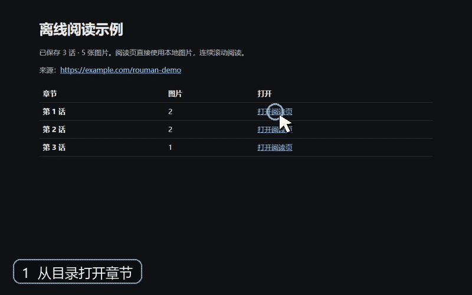
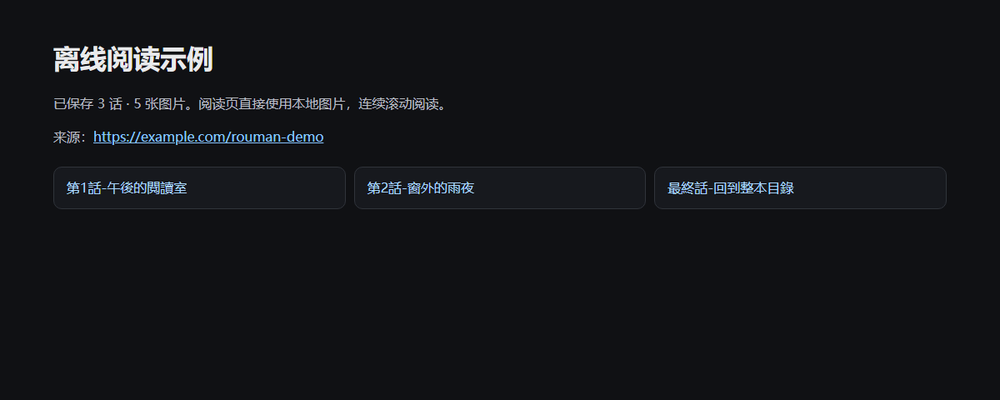

# rouman-chapter-download

一个用于 Rouman 漫画的 Codex skill：下载用户指定的章节图片，按页面顺序编号，保存网站原始章节名，并生成带有上一章、目录和下一章导航的无间距离线 HTML 阅读页。默认不生成 PDF。

## 效果预览



演示流程：从整本目录打开章节，连续阅读后进入下一章，再随时返回目录。演示图使用独立生成的占位画面，不包含实际漫画内容。

### 整本目录



### 章节阅读页


## 安装

需要 Python 3.9 或更新版本。安装图片处理依赖：

```sh
python -m pip install -r requirements.txt
```

在 Codex 中，从本仓库的 `skills/rouman-chapter-download` 目录安装 skill。已安装版本与仓库源码是两份文件；更新仓库后，需要重新安装或同步 skill。

## 使用

```sh
python skills/rouman-chapter-download/scripts/rouman_downloader.py https://rouman5.com/books/BOOK_ID --list
python skills/rouman-chapter-download/scripts/rouman_downloader.py https://rouman5.com/books/BOOK_ID --chapter 0
python skills/rouman-chapter-download/scripts/rouman_downloader.py https://rouman5.com/books/BOOK_ID --all
python skills/rouman-chapter-download/scripts/rouman_downloader.py https://rouman5.com/books/BOOK_ID --refresh-index
```

章节 URL 的 `/0` 对应本地 `chapter_001`。默认将每本漫画存放在运行命令时所在目录的 `downloads/` 下；使用 `--out <目录>` 可自行选择保存位置。章节阅读页直接读取本地图片，整本目录为 `index.html`。原始章节名保存在 `chapters/chapter_titles.json`，目录页将“章节名”和“打开阅读页”合并为一个链接，并按桌面三列、窄屏两列、手机一列排列。

已有下载如果缺少章节名，可以运行 `--refresh-index`；它只更新标题缓存、目录和章节导航，不会重新下载图片。

旧版书籍如果把 `chapter_XXX/` 和 `chapter_XXX.html` 直接放在书籍根目录，请先备份，再显式迁移：

```sh
python skills/rouman-chapter-download/scripts/rouman_downloader.py https://rouman5.com/books/BOOK_ID --migrate-layout --out <漫画库目录>
```

迁移命令不访问网站，也不重新下载图片。

只有明确需要 PDF 时才使用 `--pdf` 或 `--continuous-pdf`，并另行安装 `reportlab`。

## 下载结果结构

```text
BOOK_ID/
├── index.html
├── images/
│   ├── chapter_001/
│   └── chapter_002/
└── chapters/
    ├── chapter_titles.json
    ├── chapter_001.html
    └── chapter_002.html
```

每个章节网页的顶部和底部都提供“上一章 / 目录 / 下一章”导航；尚不存在的方向会显示为不可点击。

## 仓库结构

```text
skills/rouman-chapter-download/
├── SKILL.md
└── scripts/rouman_downloader.py
docs/images/
tests/test_rouman_downloader.py
requirements.txt
```

## 灵感来源

本项目的章节图片下载与离线阅读流程受到
[lanyeeee/jmcomic-downloader](https://github.com/lanyeeee/jmcomic-downloader)
启发。代码针对 Rouman 网站以 Python 重新实现，并非原项目的官方分支或发行版。

## 许可证

本项目采用 [MIT License](LICENSE)。
